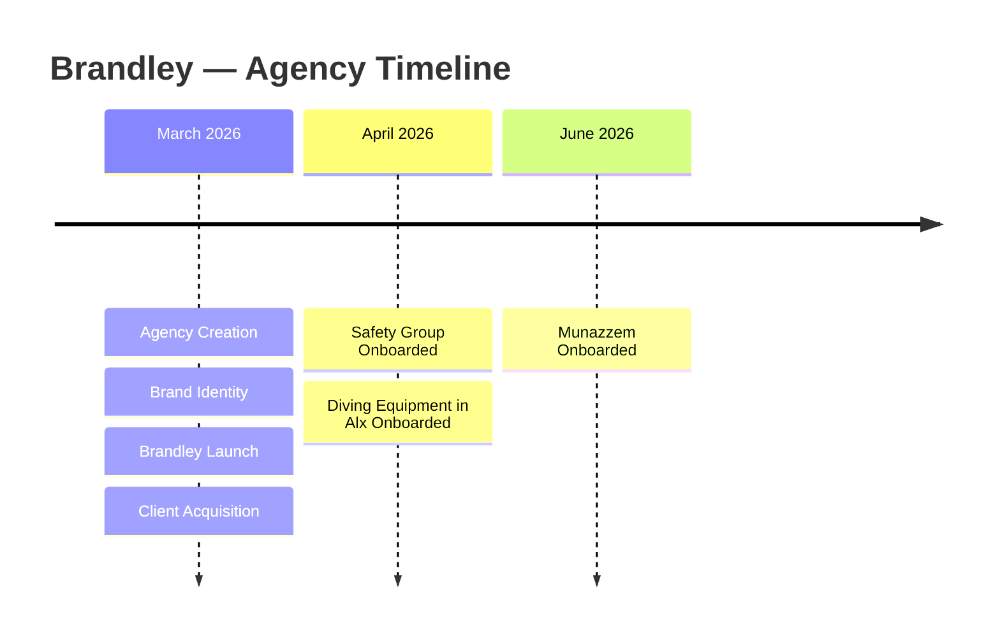

<div align="center">

# 🚀 Digital-Growth-Marketing-Agency

### *Building a Real AI-Powered Marketing Agency from the Ground Up*

<br/>


<br/><br/>

[](#)
[](#)
[](#)
[](#)
[](#)
[](#)

<br/>

[](#)
[](#)
[](#)
[](#)
[](#)
[](#)

<br/>

**An AI-first digital marketing agency, built and operated by a real team, for real clients, as a graduation project under the Digital Egypt Pioneers Initiative (DEPI).**

</div>

<br/>

---

## 📋 Table of Contents

- [🌐 Project Overview](#-project-overview)
- [🏢 About Brandley](#-about-brandley)
- [🤖 The AI Advantage](#-the-ai-advantage)
- [👥 Team Members](#-team-members)
- [🎯 Project Objectives](#-project-objectives)
- [🛠️ Services](#️-services)
- [⚙️ Tech Stack](#️-tech-stack)
- [📅 Timeline](#-timeline)
- [💼 Client Portfolio](#-client-portfolio)
  - [🔥 Project 01 — Safety Group](#-project-01--safety-group)
  - [📚 Project 02 — Munazzem](#-project-02--munazzem)
  - [🤿 Project 03 — Diving Equipment in Alx](#-project-03--diving-equipment-in-alx)
- [🔭 Our Vision](#-our-vision)
- [🎯 Our Mission](#-our-mission)
- [💡 Why Choose Brandley](#-why-choose-brandley)
- [🧠 AI Workflow](#-ai-workflow)
- [📈 Our Marketing Process](#-our-marketing-process)
- [🎨 Our Creative Process](#-our-creative-process)
- [📊 Agency Statistics](#-agency-statistics)
- [🗂️ Repository Structure](#️-repository-structure)
- [🚀 Future Roadmap](#-future-roadmap)
- [📬 Contact & Footer](#-contact--footer)

---

## 🌐 Project Overview

<div align="center">

**This is not a university exercise. This is a real, operating digital marketing agency.**

</div>

This repository documents the **Final Graduation Project** for the **Digital Egypt Pioneers Initiative (DEPI)**, sponsored by Egypt's **Ministry of Communications and Information Technology (MCIT)**.

Unlike conventional graduation projects that simulate a business idea on paper, our team set out to do something more ambitious: **build, launch, and operate a fully functioning digital marketing agency** — from naming and branding, to client acquisition, to delivering paid advertising campaigns for real businesses.

> 💡 **The goal was never to build a brand. The goal was to build an agency that builds brands.**

Throughout this project, our team handled the complete lifecycle of an agency's operations, including:

| Area | Description |
|---|---|
| 🏗️ **Agency Creation** | Structuring the agency's operations, roles, and workflows |
| 🎨 **Business & Visual Identity** | Designing a cohesive brand identity, logo, and visual language |
| 🧾 **Service Portfolio** | Defining a clear, marketable set of digital marketing services |
| 🌍 **Online Presence** | Building and managing social media platforms and digital assets |
| 📢 **Marketing Strategy** | Developing strategies tailored to each client's industry |
| 📱 **Social Media Management** | Planning, scheduling, and publishing content |
| 🖌️ **Graphic Design & Branding** | Producing visual assets aligned with each client's identity |
| 💰 **Media Buying & Performance Marketing** | Running and optimizing paid Meta advertising campaigns |
| ✍️ **Content Creation** | Writing copy and producing creative content |
| 🧠 **Marketing Consultation** | Advising clients on strategy and digital growth |
| 🤝 **Client Acquisition** | Sourcing, pitching, and onboarding real businesses |

---

## 🏢 About Brandley

<div align="center">


### *Brandley — The Agency Behind the Project*

</div>

As part of this graduation project, our team founded and launched a real digital marketing agency under the name **Brandley**.

> ⚠️ **Important distinction:** *Brandley is not the project itself — Brandley is the agency we built **during** the project.* The project is the academic and operational framework; Brandley is the living, breathing business that resulted from it.

Through Brandley's social media presence, outreach efforts, and demonstrated results, our team successfully **acquired real clients** and delivered **complete, end-to-end digital marketing services** — including brand identity design, content strategy, social media management, and paid Meta advertising campaigns.

Brandley was built with one core differentiator in mind: **Artificial Intelligence is not an add-on — it is the operating system of the agency.**

---

## 🤖 The AI Advantage

<div align="center">

### *Brandley's single biggest competitive advantage is that it is an AI-powered digital marketing agency.*

</div>

Artificial Intelligence is integrated into nearly **every stage** of Brandley's workflow — not as a gimmick, but as a genuine productivity and quality multiplier that allows a small, lean team to operate with the speed and output of a much larger agency.

<table>
<tr>
<th>Workflow Stage</th>
<th>How AI Is Applied</th>
</tr>
<tr>
<td>🔍 <b>Market Research</b></td>
<td>Rapidly synthesizing industry trends, target audience behavior, and market gaps</td>
</tr>
<tr>
<td>🕵️ <b>Competitor Analysis</b></td>
<td>Identifying competitor positioning, messaging gaps, and differentiation opportunities</td>
</tr>
<tr>
<td>📈 <b>Marketing Strategy</b></td>
<td>Structuring data-informed strategies tailored to each client's niche</td>
</tr>
<tr>
<td>🗓️ <b>Content Planning</b></td>
<td>Generating content calendars and thematic pillars at scale</td>
</tr>
<tr>
<td>✍️ <b>Copywriting</b></td>
<td>Drafting and refining persuasive, on-brand marketing copy</td>
</tr>
<tr>
<td>🎨 <b>Graphic Design Assistance</b></td>
<td>Accelerating ideation and visual concept generation</td>
</tr>
<tr>
<td>💡 <b>Creative Ideation</b></td>
<td>Producing high volumes of creative concepts for client review</td>
</tr>
<tr>
<td>📋 <b>Campaign Planning</b></td>
<td>Structuring campaign objectives, audiences, and creative testing plans</td>
</tr>
<tr>
<td>⚙️ <b>Workflow Automation</b></td>
<td>Streamlining repetitive operational tasks across the agency</td>
</tr>
<tr>
<td>🚀 <b>Productivity Enhancement</b></td>
<td>Enabling a five-person team to deliver agency-grade output</td>
</tr>
</table>

> 🧠 **In short:** Where a traditional agency relies purely on manual hours, Brandley combines human strategic judgment with AI-accelerated execution — resulting in faster turnaround, more creative iterations, and leaner operating costs.

---

## 👥 Team Members

<div align="center">

| Name | Role |
|---|---|
| 👨‍💼 **Elsayed Ahmed** | Team Leader & Social Media Specialist |
| ✍️ **Ammar Serera** | Content Specialist |
| 💰 **Ahmed Ashraf** | Media Buyer |
| 💰 **Youssef Emad** | Media Buyer |
| 🎨 **Mohamed Hossam** | Graphic Designer |

</div>

<div align="center">

### 🎓 Project Instructor

**Momen Elbadry**

</div>

---

## 🎯 Project Objectives

- ✅ Build a real, operating digital marketing agency
- ✅ Acquire real clients from diverse industries
- ✅ Build a professional, cohesive agency identity
- ✅ Provide complete, end-to-end digital marketing services
- ✅ Apply Artificial Intelligence throughout marketing workflows
- ✅ Gain practical, hands-on agency experience
- ✅ Work directly with real businesses and real budgets

---

## 🛠️ Services

<div align="center">

| Category | Services |
|---|---|
| 🎨 **Brand & Design** | Brand Identity · Logo Design · Graphic Design |
| 📱 **Social & Content** | Social Media Management · Content Strategy · Content Planning · Copywriting |
| 📊 **Strategy & Growth** | Marketing Strategy · Marketing Consultation |
| 💰 **Paid Media** | Media Buying · Meta Advertising · Performance Marketing |
| 🤖 **AI Services** | AI-Powered Marketing Solutions |

</div>

---

## ⚙️ Tech Stack

<div align="center">

| Category | Tools |
|---|---|
| 📣 **Advertising & Distribution** | Meta Business Suite · Meta Ads Manager · Facebook · Instagram |
| 🎨 **Design & Creative** | Canva · Adobe Photoshop · CapCut |
| 🤖 **AI & Productivity** | ChatGPT · AI Tools |
| 💻 **Collaboration & Documentation** | GitHub · Google Drive |

</div>

---

## 📅 Timeline

<div align="center">



</div>

| Month | Milestone |
|---|---|
| 🗓️ **March 2026** | Agency Creation · Brand Identity Development · Brandley Official Launch · Client Acquisition Begins |
| 🗓️ **April 2026** | Onboarded **Safety Group** (Fire Protection Systems) |
| 🗓️ **April 2026** | Onboarded **Diving Equipment in Alx** (Water Sports & Diving Equipment) |
| 🗓️ **June 2026** | Onboarded **Munazzem** (Educational Technology) |

---

## 💼 Client Portfolio

<div align="center">

### *From fire safety to scuba diving to educational technology — Brandley delivered tailored marketing solutions across genuinely different industries.*

</div>

Brandley did not limit itself to a single niche. Over the course of this project, our team worked with businesses spanning **industrial safety equipment**, **educational technology**, and **water sports retail** — proving the agency's ability to adapt strategy, tone, and creative direction to fundamentally different audiences and markets.

Below are detailed case studies for each client engagement.

<br/>

### 🔥 Project 01 — Safety Group

<table>
<tr>
<td width="50%">

**🏭 Industry**
Fire Protection Systems

**📝 Business Description**
Safety Group is a company specialized in supplying and installing fire protection systems and firefighting equipment.

**🆕 Starting Point**
This client started completely from scratch — with no prior digital presence.

</td>
<td width="50%">

**🛠️ What We Built**
- Facebook Page (from zero)
- Brand Identity
- Visual Identity
- Content Strategy & Planning
- Graphic Design
- Social Media Management
- Marketing Consultation
- Meta Advertising

</td>
</tr>
</table>

#### 🎯 Campaign Objective
**Facebook Page Likes**

#### 📊 Campaign Results

<div align="center">

| Metric | Result |
|---|---|
| 👍 **Page Likes** | **783** |
| 👁️ **Reach** | **12,881** |
| 📣 **Impressions** | **21,677** |
| 💰 **Amount Spent** | **EGP 1,403.51** |
| 📉 **Cost Per Like** | **EGP 1.79** |

</div>

#### 🏆 Achievement

Starting with zero digital footprint, our team established Safety Group's **entire online presence from the ground up** — designing its brand identity, building its visual language, and launching its first-ever social media platform. Through a carefully optimized Meta advertising campaign, we built the client's **first real online audience**, achieving a highly efficient cost-per-like and laying the foundation for long-term digital growth in a traditionally offline, B2B-driven industry.

#### 🖼️ Project Gallery

<div align="center">
<table>
<tr>
<td></td>
<td></td>
</tr>
<tr>
<td></td>
<td></td>
</tr>
</table>
</div>

<details>
<summary>📌 View Detailed Scope of Work for Safety Group</summary>

<br/>

- Conducted market and competitor research within the fire protection industry
- Designed a professional brand identity reflecting trust, safety, and reliability
- Created and optimized the company's first Facebook Page
- Developed a tailored content strategy and monthly content calendar
- Produced graphic design assets for organic and paid content
- Planned and executed a Meta advertising campaign focused on page growth
- Provided ongoing marketing consultation to guide digital strategy

</details>

<br/>

---

### 📚 Project 02 — Munazzem

<table>
<tr>
<td width="50%">

**💻 Industry**
Educational Technology

**📝 Business Description**
Munazzem is an educational management system that helps teachers and educational centers manage:

- Attendance
- Students
- Grades
- Parents
- Financial Records
- Schedules
- Assistants

</td>
<td width="50%">

**🛠️ What We Built**
- Brand Identity
- Logo Design
- Facebook Page
- Content Strategy & Planning
- Graphic Design
- Marketing Consultation
- Social Media Management
- Original 3D Brand Mascot

</td>
</tr>
</table>

#### 🧸 Brand Character

As part of Munazzem's brand identity, our creative team developed a **completely original, AI-generated 3D brand mascot** — a unique character designed specifically to represent Munazzem's friendly, organized, and tech-forward personality across all social media and marketing materials.

#### 🏆 Achievement

Before a single advertising riyal or pound was spent, our team ensured that Munazzem's **complete digital identity** — logo, mascot, visual language, Facebook presence, and content strategy — was fully developed and production-ready. This disciplined, identity-first approach ensures that future paid advertising campaigns will launch on top of a strong, recognizable, and trustworthy brand foundation.

#### 🖼️ Project Gallery

<div align="center">
<table>
<tr>
<td></td>
<td></td>
</tr>
<tr>
<td></td>
<td></td>
</tr>
</table>
</div>

<details>
<summary>📌 View Detailed Scope of Work for Munazzem</summary>

<br/>

- Designed a complete brand identity and logo system for an EdTech product
- Created an original 3D brand mascot as a signature visual asset
- Built and launched the official Facebook Page
- Developed a content strategy aligned with the education sector
- Produced a structured content calendar and graphic design assets
- Delivered ongoing marketing consultation ahead of future campaigns

</details>

<br/>

---

### 🤿 Project 03 — Diving Equipment in Alx

<table>
<tr>
<td width="50%">

**🌊 Industry**
Water Sports & Diving Equipment

**📝 Business Description**
A specialized company selling premium scuba diving equipment and accessories in Alexandria.

</td>
<td width="50%">

**🛠️ Responsibilities**
- Content Strategy & Planning
- Graphic Design
- Product Showcase Designs
- Facebook Page Management
- Visual Identity

</td>
</tr>
</table>

#### 🏆 Achievement

Our team transformed the client's existing Facebook page from a basic product listing space into a **visually professional, brand-consistent platform**. Through refined product showcase designs and a structured visual identity, the page was elevated to a standard ready for future paid advertising campaigns — positioning the brand competitively within Alexandria's growing water sports market.

#### 🖼️ Project Gallery

<div align="center">
<table>
<tr>
<td></td>
<td></td>
</tr>
<tr>
<td></td>
<td></td>
</tr>
</table>
</div>

<details>
<summary>📌 View Detailed Scope of Work for Diving Equipment in Alx</summary>

<br/>

- Audited the existing Facebook presence and identified branding gaps
- Designed a refreshed visual identity for product-focused content
- Created professional product showcase graphics
- Developed a content strategy tailored to a niche retail audience
- Managed and scheduled ongoing page content
- Prepared the brand for future Meta advertising campaigns

</details>

---

## 🔭 Our Vision

<div align="center">

> *To become a leading AI-powered digital marketing agency that redefines how small and medium businesses grow online — combining human creativity with artificial intelligence to deliver results that were once only possible for large, well-funded brands.*

</div>

---

## 🎯 Our Mission

<div align="center">

> *To empower real businesses, across any industry, with smart, data-informed, and creatively executed marketing solutions — powered by AI, delivered by a dedicated and skilled team.*

</div>

---

## 💡 Why Choose Brandley

| Reason | Why It Matters |
|---|---|
| 🤖 **AI-First Operations** | Faster research, content, and creative cycles than traditional agencies |
| 🎯 **Proven Results** | Real campaigns, real clients, real measurable outcomes |
| 🏗️ **Built From Zero** | Demonstrated ability to launch a digital presence with no prior foundation |
| 🌍 **Cross-Industry Expertise** | Successfully adapted strategy across safety, education, and retail sectors |
| 🤝 **Client-Centric Approach** | Every strategy tailored to the client's specific audience and goals |
| 📈 **Performance-Driven** | Every campaign measured by clear, transparent KPIs |

---

## 🧠 AI Workflow

```
 ┌─────────────────┐     ┌──────────────────┐     ┌──────────────────┐
 │  Market & Audience│ → │   AI-Assisted     │ → │   Human Strategic │
 │     Research      │   │ Content & Creative│   │   Review & Refine │
 └─────────────────┘     └──────────────────┘     └──────────────────┘
          │                                                │
          ▼                                                ▼
 ┌─────────────────┐                              ┌──────────────────┐
 │ Campaign Planning │ ←──────────────────────────│  Client Approval  │
 │   & Targeting     │                              │   & Sign-off      │
 └─────────────────┘                              └──────────────────┘
          │
          ▼
 ┌─────────────────┐
 │  Execution, Media │
 │ Buying & Reporting │
 └─────────────────┘
```

AI is woven into the **research**, **planning**, and **creative** stages, while human judgment governs **strategy approval**, **client communication**, and **final quality control** — ensuring speed never comes at the cost of brand integrity.

---

## 📈 Our Marketing Process

1. 🔍 **Discovery** — Understand the client's business, audience, and goals
2. 🕵️ **Research** — AI-assisted market and competitor analysis
3. 📋 **Strategy** — Build a tailored marketing and content strategy
4. 🎨 **Creative Production** — Design, copywriting, and content creation
5. 📅 **Planning** — Structure a content calendar and campaign roadmap
6. 💰 **Execution** — Publish content and launch paid Meta campaigns
7. 📊 **Optimization** — Monitor performance and refine in real time
8. 📑 **Reporting** — Deliver transparent, data-backed results to the client

---

## 🎨 Our Creative Process

| Stage | Description |
|---|---|
| 💡 **Ideation** | AI-accelerated brainstorming for concepts and angles |
| 🖌️ **Design** | Visual execution using Canva and Adobe Photoshop |
| ✍️ **Copywriting** | Crafting persuasive, on-brand messaging |
| 🎬 **Video & Motion** | Editing and producing short-form content with CapCut |
| ✅ **Review** | Internal quality check before client delivery |
| 📤 **Delivery** | Publishing across the client's social platforms |

**Core Pillars:** Marketing Strategy · Content Strategy · Branding · Performance Marketing · Media Buying · Audience Research · Campaign Planning · AI Integration

---

## 📊 Agency Statistics

<div align="center">

| 📌 Metric | 📈 Value |
|---|---|
| 🤝 **Clients Served** | **3** |
| 🏭 **Industries Covered** | **3** |
| ✅ **Completed Projects** | **3** |
| 💰 **Advertising Campaigns Run** | **1** |
| 🎨 **Brand Identities Created** | **2** |
| 📋 **Content Strategies Delivered** | **3** |

</div>

---

## 🗂️ Repository Structure

```
Brandley/
├── 🎨 Brand Identity/
├── 📈 Marketing Strategy/
├── 🗓️ Content Calendar/
├── 💼 Client Portfolio/
│   ├── 🔥 Safety Group/
│   ├── 📚 Munazzem/
│   └── 🤿 Diving Equipment in Alx/
├── 📑 Reports/
├── 🖥️ Presentations/
├── 🖼️ Assets/
└── 📄 README.md
```

---

## 🚀 Future Roadmap

- [ ] Expand client portfolio across additional industries
- [ ] Scale paid advertising capabilities across more platforms (Google Ads, TikTok Ads)
- [ ] Deepen AI integration with custom internal automation tools
- [ ] Build a formal case-study and reporting dashboard for clients
- [ ] Establish long-term retainer partnerships with existing clients
- [ ] Grow the Brandley team and formalize internal agency processes

---

## 📬 Contact & Footer

<div align="center">

<br/>

### 💖 Developed with passion by **Team Brandley**

<br/>

🎓 **Graduation Project**
**Digital Egypt Pioneers Initiative (DEPI)**

🏛️ Sponsored by the **Ministry of Communications and Information Technology (MCIT), Egypt**

<br/>

[](#)
[](#)

<br/>

---

<sub>© 2026 Brandley Digital Marketing Agency. All rights reserved.</sub>

</div>
